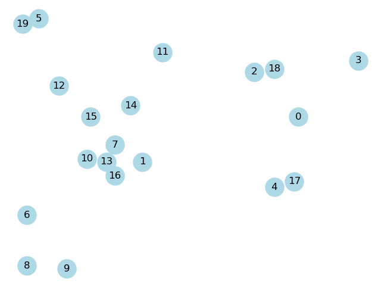
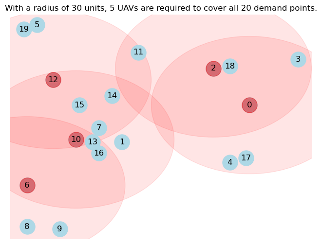

# 🛰️ Unmanned aerial vehicle set covering problem

## ✏️ Introduction

Individual assignment for the Data Analytics & Data Driven Decisions course.

This project is a set covering problem for unmanned aerial vehicle (UAV) to cover a set of targets. The problem is formulated as a mixed integer linear programming (MILP) model and solved by Gurobi solver.

Based on the Paper [Unmanned aerial vehicle set covering problem considering fixed-radius coverage constraint](https://www.researchgate.net/publication/339793999_Unmanned_Aerial_Vehicle_Set_Covering_Problem_Considering_Fixed-Radius_Coverage_Constraint), the model is extended to only consider the fixed-radius coverage constraint.

The idea behind this problem is to asssit in a region during disaster recovery. Imaging `demand_points` are people in need of aid within a certain region, how many UAVs are required to cover all demand points, based on the radius of the UAVs (`coverage_radius`).

## 📦 Installation

The following packages are required to run the code:

- [Gurobi](https://www.gurobi.com/) (you also need a licence)
- [NetworkX](https://networkx.org/)
- [Matplotlib](https://matplotlib.org/)

You should also have some sort of Python environment manager installed, such as [Anaconda](https://www.anaconda.com/).

## 📚 How it works

The `scp.ipynb` file manages all aspects of solving this problem. It starts by generating a set of demand points within a networkx graph, based on the specified regiion width & height, and the number of demand points.

Each demand point is plotted randomly on the graph, the output looks something like this:

Secondly, we define decision variables, the objective function (to minimize the number of UAVs required), and the constraints, based on the model in the paper:

### Sets

- $N$ = set of demand points
- $M$ = set of flight position of UAVs

### Parameters

- $b^x_j$ = flight position of UAV $j$ on x-coordinate
- $b^y_j$ = flight position of UAV $j$ on y-coordinate
- $\alpha_{ij}$ = binary feasibility of UAV $j$ covering demand point $i$

### Decision Variables

$$
y_j =
\begin{cases}
1,\quad \text{ if UAV $j$ is used} \\
0,\quad \text{otherwise}
\end{cases}
$$

$$
x_{ij} =
\begin{cases}
1,\quad \text{ if demand point $i$ is covered by UAV $j$} \\
0,\quad \text{otherwise}
\end{cases}
$$

$$ \forall i \in N \\ \forall j \in N$$

### Objective function

$$
\begin{alignat}{3}
& \min \sum_{j \in M}y_j \\
& \text{s.t.} x_{ij} \le y_j \quad && \forall i \in N, \forall j \in M \\
& \sum_{j \in M} \alpha_{ij}x_{ij} \ge 1 \quad && \forall i \in N \\
& x_{ij} \in \{0, 1\} \quad && \forall i \in N, \forall j \in M \\
& y_j \in \{0, 1\} \quad && \forall j \in M\end{alignat}
$$

### Distance

Distance between each demand point is calculated using the [Euclidean distance formula](https://en.wikipedia.org/wiki/Euclidean_distance): $$\sqrt{(a^x_i - b^x_j)^2 + (a^y_i - b^y_j)^2}$$

$\alpha = 1$ if distance is less than or equal to the coverage radius, $0$ otherwise.

Finally, the model is solved using Gurobi solver, and the output looks something like this:

In this particiular case, 5 UAVs are required to cover all demand points.

> Note: You may notice the number of UAVs flucuate between each run. This is because the demand points are randomly generated within the region every time, and the solver may find a different solution each time.
